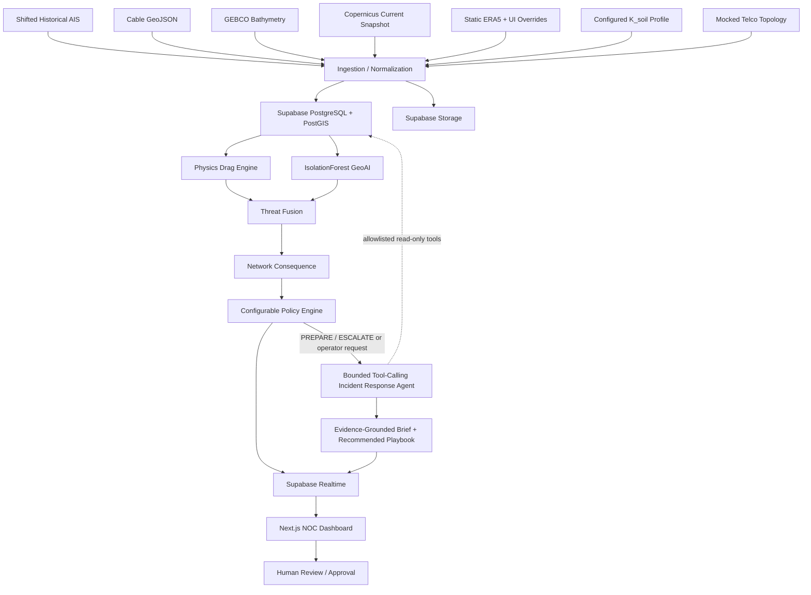

# System Architecture & Project Framework

> **Source of truth:** This architecture implements `PRD.md`. If a conflict is discovered, the PRD wins and this file must be updated.

## 📂 Project Directory Structure

This monorepo structure keeps frontend, backend, data-ingestion, spatial analytics, policy logic, the bounded runtime Agentic Incident Response layer, and Supabase security concerns separated so a coding agent does not collapse unrelated responsibilities into a few large files.

```text
SAMUDERA-App/
│
├── frontend/                         # Next.js 14+ App Router
│   ├── src/
│   │   ├── app/                      # Pages, layouts, routing
│   │   ├── components/
│   │   │   ├── map/                  # Deck.gl / React Map GL visualization
│   │   │   ├── risk/                 # Threat cards, physics inspection
│   │   │   ├── policy/               # Policy controls / rule editor
│   │   │   └── alerts/               # Monitor / Prepare / Escalate UI
│   │   ├── lib/
│   │   │   ├── api/                  # FastAPI client/fetchers
│   │   │   └── supabase/             # Browser-safe Supabase clients
│   │   └── types/                    # Shared frontend TypeScript types
│   ├── package.json
│   └── tailwind.config.js
│
├── backend/                          # Python FastAPI service
│   ├── app/
│   │   ├── main.py                   # FastAPI entrypoint
│   │   ├── api/                      # HTTP route handlers
│   │   ├── core/                     # Configuration, auth/JWT helpers
│   │   ├── schemas/                  # Pydantic request/response schemas
│   │   ├── services/
│   │   │   ├── ingestion/            # Cable, AIS, GEBCO, Copernicus, ERA5 loaders
│   │   │   ├── spatial.py            # PostGIS queries + GeoPandas preprocessing
│   │   │   ├── physics_engine.py     # Wind/current/wave vector math
│   │   │   ├── ml_anomaly.py         # IsolationForest trajectory model
│   │   │   ├── threat_fusion.py      # Physics + anomaly + cable interaction
│   │   │   ├── consequence.py        # Criticality/redundancy/SLA consequence
│   │   │   ├── policy_engine.py      # Tenant-configurable escalation rules
│   │   │   └── dispatch.py           # Human-review dispatch draft generation
│   │   ├── agent/
│   │   │   ├── orchestrator.py       # Multi-step incident-response agent loop
│   │   │   ├── tools.py              # Allowlisted read-only context tools
│   │   │   ├── schemas.py            # Structured agent input/output contracts
│   │   │   ├── provider.py           # Tool-capable LLM provider adapter
│   │   │   └── guardrails.py         # Authority, tenant-scope, evidence checks
│   │   └── db/                       # Database access/repository helpers
│   ├── tests/                        # Unit/integration tests
│   └── requirements.txt
│
├── supabase/
│   ├── migrations/                   # Tables, PostGIS indexes, RLS policies
│   └── seed.sql                      # Demo tenants/policies/topology data
│
├── data/                             # Local/sample data only; large/private files gitignored
│   ├── ais/
│   ├── bathymetry/
│   ├── metocean/
│   └── fixtures/
│
├── PRD.md
├── ARCHITECTURE.md
├── README.md
└── vercel.json                       # Optional deployment/routing configuration
```

### Structure Rules

* The frontend must not contain physics, anomaly-model, consequence, or policy calculations that are authoritative for alerts.
* The backend owns risk computation and policy evaluation.
* The Agentic Incident Response layer may orchestrate approved read-only context tools and generate recommendations, but it must never become the authoritative source of risk state or policy classification.
* PostGIS is the production spatial-query layer; GeoPandas/Shapely are used for ETL, preprocessing, and local/batch geospatial operations.
* Supabase RLS migrations belong under `supabase/migrations/`; do not hide tenant-security rules inside application code only.
* Agent tool calls must execute server-side through an explicit allowlist, inherit tenant scope, and record an audit trace. No LLM may receive database service-role credentials.
* Large source datasets and secrets must not be committed to Git.

---

## 🧩 Core Modules Explanation

### Module A — Geospatial Data Ingestion & Spatial Indexing

* Fetches and normalizes cable/landing-point GeoJSON from the Submarine Cable Map v3 endpoints.
* Loads **shifted historical Kattegat AIS telemetry** for the MVP; it must not be labeled as live AIS.
* Loads **GEBCO 2026 bathymetry for water depth only**.
* Loads a separate configured/mocked $K_{\text{soil}}$ corridor holding profile for the MVP. GEBCO must not be used to infer mud/sand substrate type.
* Converts a downloaded Copernicus `GLOBAL_ANALYSISFORECAST_PHY_001_024` NetCDF subset into localized current-vector data using `xarray`.
* Uses a static ERA5 wind/wave baseline plus UI what-if overrides.
* Persists normalized operational geometry/data in Supabase PostgreSQL/PostGIS and caches large geospatial/metocean artifacts in Supabase Storage where appropriate.
* Uses GiST-indexed PostGIS `ST_DWithin` / `ST_Intersects` for production proximity checks; GeoPandas spatial indexing is optional for ETL/preprocessing.

### Module B — Dual-Engine Risk Modeling

1. **Physics Drag Engine**
   * Calculates $\vec{F}_{\text{wind}}$, $\vec{F}_{\text{current}}$, and $\vec{F}_{\text{wave}}$.
   * Computes $\vec{F}_{\text{env}}$ and compares its magnitude with estimated holding capacity $F_{\text{hold,crit}}$.
   * Outputs $R_{\text{drag}} = |\vec{F}_{\text{env}}| / F_{\text{hold,crit}}$.

2. **Unsupervised GeoAI Engine**
   * MVP baseline: `IsolationForest` from scikit-learn.
   * Features include SOG, COG-derived behavior, and dwell/loitering duration.
   * Outputs an anomaly flag/score; it does not independently decide the final escalation state.

### Module C — Threat Fusion, Network Consequence & Policy

The backend processes signals in this order:

```text
Physics R_drag ───────┐
                      ├─> Cable Interaction & Threat Fusion
Trajectory Anomaly ──┘                 │
                                        v
                         Network Consequence Engine
                     (criticality + effective redundancy + SLA)
                                        │
                                        v
                          Configurable Policy Engine
                                        │
                     ┌──────────────────┼──────────────────┐
                     v                  v                  v
                  MONITOR       PREPARE BACKUP         ESCALATE
```

The default operational policy thresholds are:

* `MONITOR`: $R_{\text{drag}} < 0.60$ or normal transit behavior.
* `PREPARE BACKUP`: $0.60 \le R_{\text{drag}} < 0.85$ with vessel slowing inside the cable buffer zone.
* `ESCALATE`: $R_{\text{drag}} \ge 0.85$ or an anomaly is detected over a high-criticality cable.

These are **policy thresholds**, not the same thing as the physical load-limit bands. The physics model reaches its estimated holding limit at approximately $R_{\text{drag}} = 1.0$; policy may escalate earlier as a precaution.

### Module D — Human-in-the-Loop NOC Command Dashboard

* Next.js + Deck.gl / React Map GL spatial dashboard.
* Target: up to 2,000 vessel vectors at $\ge 50$ FPS under the designated benchmark environment.
* Flagged-vessel inspection exposes wind/current/wave forces, depth, configured substrate factor, anomaly result, and business consequence.
* Supabase Realtime synchronizes alert acknowledgements and status changes across authorized sessions.
* `ESCALATE` produces a **draft** external dispatch. It is never transmitted automatically; a human operator must approve external communication.

### Module E — Bounded Agentic Incident Response

The runtime agent is a **post-policy orchestration layer**, not another risk model. It is triggered automatically for `PREPARE BACKUP` / `ESCALATE` events or manually by an authorized operator.

**Agent goal:** gather the smallest set of authoritative evidence required to explain the incident and propose the next NOC actions.

**Allowlisted read-only tools:**

* `get_threat_snapshot(threat_id)` — authoritative policy state, vessel/corridor IDs, timestamps.
* `get_recent_trajectory(vessel_id)` — recent normalized AIS trajectory/features.
* `get_physics_breakdown(threat_id)` — $R_{drag}$, force components, holding-capacity inputs.
* `get_anomaly_result(threat_id)` — IsolationForest score/flag and trajectory features.
* `get_cable_context(segment_id)` — cable geometry/corridor context.
* `get_network_consequence(segment_id)` — criticality, effective redundancy, SLA exposure inputs/result.
* `get_tenant_policy(tenant_id, corridor_id)` — the rules that produced the authoritative operational state.

The agent may choose the order/number of tool calls and re-query context if required. Its final structured output contains the authoritative state, evidence summary, uncertainty/missing-data flags, and recommended playbook. For `ESCALATE`, it may prepare or refine a dispatch draft for operator review.

**Hard boundary:** the agent cannot change deterministic calculations, policy state, tenant rules, alert acknowledgement state, network routing, or external communications. If evidence is incomplete or contradictory, it returns `NEEDS HUMAN REVIEW`.

Every run is auditable: trigger, tool calls, evidence references, model/provider metadata, generated recommendation, and human approval/rejection outcome are persisted server-side.

---

## 🗄️ Data Model Design (Minimum Dictionary)

| Category | Variable | Source | Purpose |
| :--- | :--- | :--- | :--- |
| **Vessel Telemetry** | Lat, Lon, SOG, COG, Heading, MMSI, Vessel Class | Shifted Kattegat AIS CSV | Tracks simulated/historical vessel motion and position. |
| **Cable Infrastructure** | Line Coordinates, Landing Nodes, Cable Names | Submarine Cable Map / TeleGeography-derived v3 endpoints | Maps subsea cable assets and Mersing landing systems. |
| **Bathymetry** | Water Depth ($D_{\text{water}}$) | GEBCO 2026 Grid | Provides depth for spatial context and physics inputs. |
| **Substrate / Holding Profile** | $K_{\text{soil}}$ | Configured/mocked MVP corridor profile | Adjusts estimated anchor holding capacity; not derived from GEBCO. |
| **Metocean Currents** | Eastward ($U$), Northward ($V$) velocity | Copernicus (`GLOBAL_ANALYSISFORECAST_PHY_001_024`) | Supplies current vectors; MVP may use a downloaded snapshot. |
| **Metocean Weather** | Wind speed/direction, significant wave height, optional wave period | Static ERA5 + UI Overrides | Supplies baseline wind/wave inputs and what-if stress tests. |
| **Network Topology** | Segment ID, Criticality Tier, Effective Redundancy ($\ge 1$), SLA inputs | Mocked Telco Data | Calculates business consequence and policy context. |
| **Agent Run Context** | Incident ID, authoritative state, evidence refs, uncertainty flags | Backend + Supabase | Grounds agent runs in deterministic system outputs. |
| **Agent Audit Record** | Trigger, tool calls, model metadata, recommendation, human outcome | Backend + Supabase | Makes agentic behavior traceable and reviewable. |

---

## 🔄 End-to-End Data Flow



---

## ☁️ Runtime & Deployment Architecture

### Frontend

* **Next.js 14+**, React, TypeScript
* Tailwind CSS
* Deck.gl + React Map GL / Mapbox-compatible basemap
* Supabase Auth and Realtime browser client
* Deployed on **Vercel**

### Backend

* **FastAPI**
* **Python 3.12+ for the Vercel deployment baseline**
* GeoPandas + Shapely for ETL/preprocessing
* PostGIS for production spatial queries
* scikit-learn `IsolationForest`
* `xarray` / NetCDF parsing
* Server-side tool-calling LLM adapter for the bounded Agentic Incident Response layer
* Allowlisted read-only agent tools + structured agent schemas/guardrails
* Deployable with Vercel's supported FastAPI/Python runtime for the MVP

### Data Platform

* Supabase PostgreSQL
* PostGIS extension + GiST indexes
* Supabase Auth (JWT)
* Supabase RLS for multi-tenant isolation
* Supabase Realtime
* Supabase Storage

---

## 🔐 Security Boundaries

1. **Frontend credentials**
   * May contain only browser-safe Supabase publishable credentials.
   * Never expose Supabase secret/service-role keys through `NEXT_PUBLIC_*` variables.

2. **Backend elevated credentials**
   * Secret/service-role credentials are server-only.
   * Use them only for trusted administrative or ingestion operations that intentionally bypass user RLS.
   * Normal tenant/user requests should preserve authenticated user context and enforce RLS/tenant authorization.

3. **Tenant isolation**
   * `auth.uid()` identifies the user.
   * RLS must additionally verify tenant membership/role before tenant-scoped data is returned or modified.

4. **Agent boundary**
   * The runtime agent is server-side only.
   * Agent tools are explicit, allowlisted, tenant-scoped, and read-only for the MVP.
   * The LLM receives only minimum incident context and never receives Supabase service-role credentials or unrelated tenant data.
   * Agent outputs never override deterministic analytics or policy classification and cannot create external side effects.
   * Each run records its tool/evidence trace and human outcome.

5. **Transport/storage**
   * Public traffic uses HTTPS with TLS 1.2 or newer.
   * Supabase-hosted data uses provider-managed encryption at rest.

---

## 🛡️ Coding Requirements & Restrictions (NFRs)

1. **Security & Multi-Tenant Isolation**
   * RLS must protect tenant-scoped tables.
   * No secret/service-role key may appear in browser code or source control.
   * External dispatches remain human-approved.

2. **Performance Targets**
   * Frontend mapping target: up to 2,000 simultaneous vessel vectors at $\ge 50$ FPS under the documented demo benchmark.
   * Indexed PostGIS `ST_DWithin` query target: $< 50$ ms at the database/query layer for the MVP dataset.

3. **Real-Time Sync Target**
   * Alert acknowledgement/status propagation target: $< 300$ ms under the designated demo/test environment via Supabase Realtime.

4. **Data Honesty**
   * Shifted Kattegat AIS must be labeled simulated/historical.
   * ERA5 baseline must be labeled static unless a live ingestion pipeline is actually implemented.
   * GEBCO must not be labeled as a mud/sand or sediment-classification source.

5. **Model Semantics**
   * $R_{\text{drag}}$ is a susceptibility/load ratio, not a failure probability.
   * `IsolationForest` is the MVP anomaly baseline.
   * Final `MONITOR` / `PREPARE BACKUP` / `ESCALATE` state is produced by the policy layer, not by the ML model alone.

6. **Agentic AI Safety & Traceability**
   * The agent is automatically invoked only for `PREPARE BACKUP` / `ESCALATE` or explicitly by an authorized operator.
   * The agent may choose and sequence approved read-only context tools, but cannot write operational state or perform external actions.
   * Recommendations must reference retrieved/calculated evidence and surface uncertainty or missing data instead of fabricating facts.
   * All agent runs, tool calls, evidence references, model/provider metadata, and operator outcomes must be auditable.
