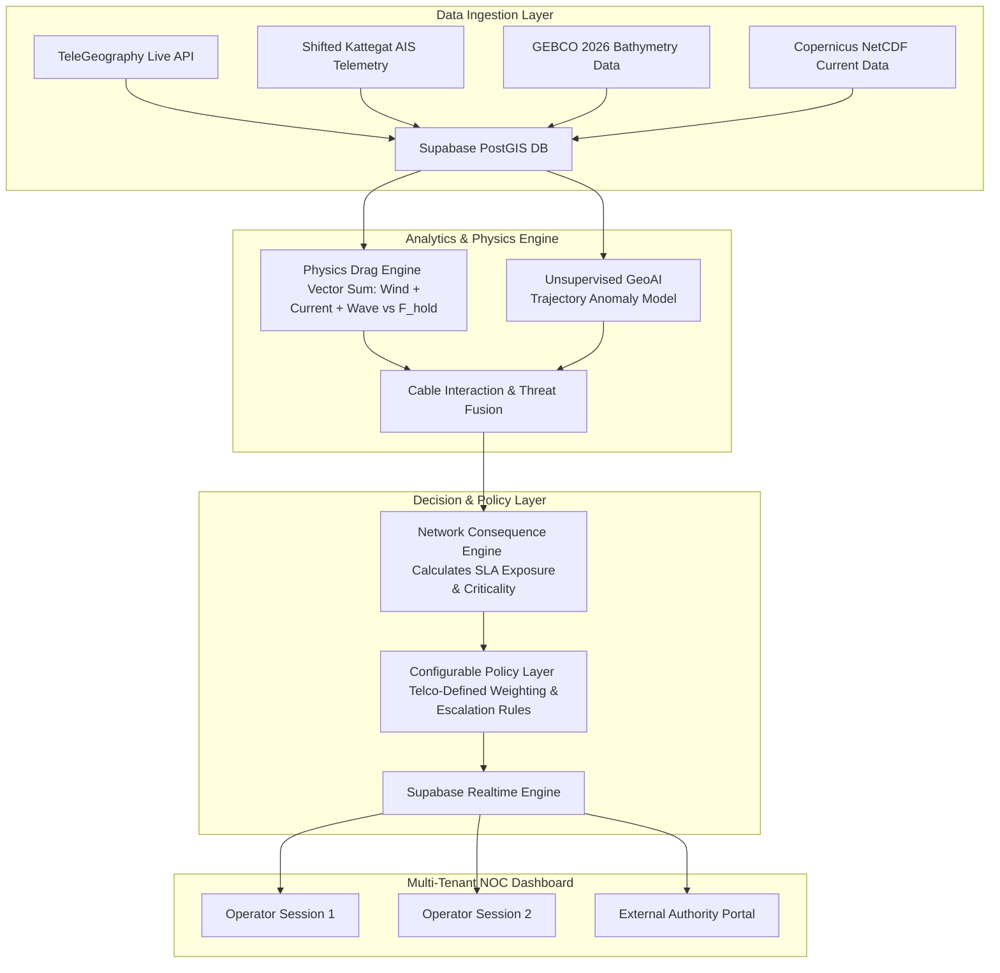

# Product Requirements Document (PRD)

## Product Title: SAMUDERA (Spatial Analytics for Maritime Utilities & Drag Early-warning Risk Automation)

* **Document Version:** 1.0.0 (Production & Deployment Ready)
* **Target Track:** GeoAI 2026 — Industry Improvement (II) Track
* **Target Industry:** Telecommunications, Submarine Cable Consortiums, Infrastructure Defense
* **MVP Target Region:** Mersing Subsea Cable Corridor (AAG, ASE, East-West, SEAX-1, SKR1M)
* **Deployment Stack:** Next.js 14+ (Vercel) + FastAPI (Python) + Supabase (PostgreSQL / PostGIS / Auth)

---

## 1. Document Control & Metadata

| Attribute | Details |
| --- | --- |
| **System Name** | S.A.M.U.D.E.R.A. |
| **Document Purpose** | Production-grade System Specification & Product Requirements |
| **Primary End-User** | Telco Network Operations Center (NOC) Engineers & Operations Managers |
| **Secondary End-User** | Submarine Cable Consortiums & Maritime Regulatory Authorities (e.g., APMM / Coast Guard) |
| **Core Architecture** | Multi-Tenant Serverless Cloud Architecture with Row-Level Security (RLS) |

---

## 2. Executive Summary & Problem Context

### 2.1 Executive Summary

Submarine telecommunications cables carry over **99% of international data traffic** across approximately 500 cable systems spanning more than 1.7 million kilometers. Dragged ship anchors account for roughly **30% of all subsea cable faults** (approximately 60 incidents annually), costing between **£500,000 and £1,000,000+ ($1.5M+ USD)** in specialized repair vessel mobilization per incident, alongside months of lost capacity and severe B2B Service Level Agreement (SLA) financial penalties.

Existing commercial solutions (e.g., AssetMonitor, OptoDAS) focus strictly on physical detection—notifying operators *that* a vessel is near a cable. **S.A.M.U.D.E.R.A.** acts as the critical **Translation and Decision Layer** above detection. By fusing seafloor geophysics, hydrodynamic drag vectors, vessel trajectory telemetry, and subsea cable topology, the system quantifies business impact and runs risk scores through a **Configurable Policy Layer**. The platform delivers human-in-the-loop escalation recommendations (`MONITOR`, `PREPARE BACKUP`, `ESCALATE`) to NOC operators before physical strikes occur, eliminating alarm fatigue and allowing proactive traffic protection.

### 2.2 Strategic Value Propositions

* **Proactive Traffic Protection:** Shifts NOC operations from reactive post-cut disaster recovery to proactive traffic rerouting preparation before physical strikes occur.
* **Reduction of Alarm Fatigue:** Replaces arbitrary spatial proximity alerts with a dual-engine model combining hydrodynamic drag physics vectors and unsupervised trajectory anomaly detection.
* **Enterprise Multi-Tenant Customization:** Enables individual telecommunications providers to define custom escalation rules, SLA cost matrices, and notification hierarchies through a modular rules manager.

---

## 3. Stakeholders & Value Proposition Matrix

| Stakeholder Group | Primary Role | Operational Pain Point | S.A.M.U.D.E.R.A. Solution & Gain |
| --- | --- | --- | --- |
| **Telco NOC Engineers** | Primary Operator | Alarm fatigue from false alerts; delayed notification forcing reactive post-cut chaos. | Receives mathematically justified, prioritized risk scores with clear escalation paths (`PREPARE BACKUP`). |
| **Cable Consortiums / Owners** | Primary Beneficiary | $1.5M+ USD in emergency repair vessel charter costs and long repair delays. | Prevents physical anchor strikes, protecting subsea assets and eliminating repair mobilization OpEx. |
| **Enterprise Clients** | End Consumer | Sudden service downtime, latency spikes, and severe productivity losses during unannounced cable snaps. | Zero service disruption due to smooth, planned traffic migration prior to physical cable strikes. |
| **Maritime Authorities (APMM)** | External Responder | Inability to monitor vast ocean zones efficiently; delayed communication from telcos. | Receives pre-drafted, localized VHF radio dispatches containing verified high-risk vessel coordinates. |

---

## 4. User Roles & Access Control (RBAC)

The system enforces multi-tenant security and user isolation via Supabase Authentication (JWT) and PostgreSQL Row-Level Security (RLS) policies.

```
+---------------------------------------------------------------------------------+
|                                 TENANT ISOLATION                                |
|                                                                                 |
|  +----------------------------------+    +----------------------------------+  |
|  |       TENANT A (e.g., TM)        |    |      TENANT B (e.g., Maxis)      |  |
|  |  - Custom SLA Cost Matrices      |    |  - Custom SLA Cost Matrices      |  |
|  |  - Private Cable Criticality     |    |  - Private Cable Criticality     |  |
|  |  - Custom Escalation Workflows   |    |  - Custom Escalation Workflows   |  |
|  +----------------------------------+    +----------------------------------+  |
|                                                                                 |
|                   Enforced via Supabase Row-Level Security (RLS)                |
+---------------------------------------------------------------------------------+
```

### Role Specification

1. **System Administrator / Platform Engineer:** Manages global system health, corridor boundaries, third-party API configurations, and tenant onboarding.
2. **NOC Policy Administrator:** Defines tenant-specific escalation thresholds, SLA financial exposure variables, and agency notification contacts.
3. **NOC Monitoring Operator:** Monitors real-time spatial dashboards, interacts with simulation stress-testing sliders, acknowledges system alerts, and approves dispatch recommendations.
4. **External Maritime Observer:** Accesses a restricted, read-only interface displaying verified `ESCALATE`-level threats and pre-formatted radio dispatches.

---

## 5. System Architecture & End-to-End Processing Pipeline



---

## 6. Functional Requirements

### 6.1 Module A: Geospatial Data Ingestion & Spatial Indexing

* **REQ-A1 (Cable Infrastructure Mapping):** The system shall dynamically fetch subsea cable line geometries and landing point coordinates from TeleGeography's public endpoints (`/api/v3/cable/cable-geo.json` and `/api/v3/landing-point/landing-point-geo.json`), filtering specifically for Mersing landing systems (AAG, ASE, East-West, SEAX-1, SKR1M).
* **REQ-A2 (Seabed & Bathymetry Layer):** The system shall ingest GEBCO 2026 bathymetric grids to map water depths ($D_{\text{water}}$) and attribute normalized seafloor substrate holding factors ($K_{\text{soil}}$) across the spatial grid.
* **REQ-A3 (Metocean Data Processing):** The backend shall convert NetCDF ocean current velocity fields (`GLOBAL_ANALYSISFORECAST_PHY_001_024`, specifically $U$ and $V$ components) into localized JSON vector grids using Python `xarray`.
* **REQ-A4 (Spatial Indexing Optimization):** The database and backend shall execute spatial bounding-box checks using PostGIS (`ST_DWithin`, `ST_Intersects`) or GeoPandas R-Tree indexing to maintain $O(1)$ spatial query complexity.

### 6.2 Module B: Dual-Engine Risk Modeling

* **REQ-B1 (Vector Drag Physics Engine):** The backend shall calculate total environmental drag force vectors ($\vec{F}_{\text{env}}$) acting on vessels using independent vector summation of wind, current, and wave forces, comparing the resultant magnitude against multi-factor holding capacity ($F_{\text{hold,crit}}$).
* **REQ-B2 (Interactive Weather Simulation Sliders):** The UI shall provide real-time override sliders for "Wind Speed (m/s)" and "Wave Height (m)" that dynamically recompute the physics engine on the fly for demonstration and stress-testing.
* **REQ-B3 (Unsupervised GeoAI Anomaly Engine):** The system shall run an `IsolationForest` or `DBSCAN` model (`scikit-learn`) on trajectory features—Speed Over Ground (SOG), Course Over Ground (COG), and dwell time—to flag abnormal drifting/loitering behavior without requiring labeled historical failure data.

### 6.3 Module C: Network Consequence & Configurable Policy Layer

* **REQ-C1 (Network Consequence Scoring):** The system shall calculate business risk per cable segment using:

$$\text{Network Consequence} = R_{\text{drag}} \cdot \text{Criticality Tier} \cdot \left( \frac{1}{\text{Backup Redundancy Count}} \right)$$

* **REQ-C2 (Configurable Policy Rules):** The platform shall provide a modular rules engine allowing administrators to adjust weights and set custom escalation responses per corridor:
  * `MONITOR`: $R_{\text{drag}} < 0.60$ or normal transit behavior.
  * `PREPARE BACKUP`: $0.60 \le R_{\text{drag}} < 0.85$ with vessel slowing inside the cable buffer zone. Triggers internal NOC disaster recovery prep.
  * `ESCALATE`: $R_{\text{drag}} \ge 0.85$ or trajectory anomaly flagged over a high-criticality cable. Generates automated radio dispatch drafts and alerts authorities.

### 6.4 Module D: Human-in-the-Loop NOC Command Dashboard

* **REQ-D1 (GPU-Accelerated 3D Map):** The frontend shall render dynamic vessel vectors and subsea cable lines at $\ge 50 \text{ FPS}$ using Mapbox / Deck.gl (`react-map-gl`).
* **REQ-D2 (Explainable Physics Inspection):** Clicking a flagged vessel shall display an inspectable panel showing the underlying vector forces ($\vec{F}_{\text{wind}}, \vec{F}_{\text{current}}, \vec{F}_{\text{wave}}$), depth, substrate factor, and SLA risk score.
* **REQ-D3 (Automated Dispatch Generator):** In the `ESCALATE` state, the dashboard shall generate a pre-formatted VHF radio dispatch message including vessel MMSI, GPS coordinates, corridor identifier, and navigational correction advice.

---

## 7. Mathematical & Algorithmic Specifications

### 7.1 Environmental Drag Force Vector Equations

Total environmental force acting on an anchored or drifting vessel is modeled as the vector sum of independent wind, current, and wave load vectors:

$$\vec{F}_{\text{env}} = \vec{F}_{\text{wind}} + \vec{F}_{\text{current}} + \vec{F}_{\text{wave}}$$

#### Wind Shear Force Vector

$$\vec{F}_{\text{wind}} = 0.5 \cdot \rho_{\text{air}} \cdot C_w \cdot A_w \cdot \vert{}V_{\text{wind}} - V_{\text{ship}}\vert{}^2 \cdot \hat{u}_{\text{wind}}$$

* $\rho_{\text{air}} = 1.225 \text{ kg/m}^3$ (Air density at sea level)
* $C_w$: Wind drag coefficient ($0.70 - 1.00$ for modern hull forms)
* $A_w$: Exposed frontal/side windage area ($\text{m}^2$)
* $V_{\text{wind}} - V_{\text{ship}}$: Wind velocity relative to the vessel ($\text{m/s}$)
* $\hat{u}_{\text{wind}}$: Directional unit vector of wind vector

#### Current Velocity Force Vector

$$\vec{F}_{\text{current}} = 0.5 \cdot \rho_{\text{water}} \cdot C_c \cdot A_c \cdot \vert{}V_{\text{current}} - V_{\text{ship}}\vert{}^2 \cdot \hat{u}_{\text{current}}$$

* $\rho_{\text{water}} = 1025 \text{ kg/m}^3$ (Seawater density)
* $C_c$: Current drag coefficient ($\approx 1.0$)
* $A_c$: Submerged hull wetted area ($\text{m}^2$)
* $V_{\text{current}} = \sqrt{U^2 + V^2}$: Current magnitude derived from Copernicus $U, V$ vector components ($\text{m/s}$)

#### Wave Surge Force Vector (Radiation-Stress Proxy)

Grounded in linear wave theory, scaling with wave energy density ($E \approx \frac{1}{8} \rho_{\text{water}} g H_s^2$):

$$\vec{F}_{\text{wave}} = C_{\text{wave}} \cdot K(h,T) \cdot E \cdot B_{\text{eff}} \cdot \hat{u}_{\text{wave}}$$

* $H_s$: Significant wave height ($\text{m}$)
* $g = 9.81 \text{ m/s}^2$: Gravitational acceleration
* $K(h,T)$: Depth and wave period correction factor
* $B_{\text{eff}}$: Effective vessel beam width exposed to wave direction ($\text{m}$)

### 7.2 Anchor Seabed Holding Capacity

Holding capacity is modeled using a calibratable multi-factor equation accounting for soil, anchor geometry, and depth:

$$F_{\text{hold,crit}} = F_{\text{hold,ref}} \cdot K_{\text{soil}} \cdot K_{\text{anchor}} \cdot K_{\text{scope}} \cdot K_{\text{depth}}$$

* $F_{\text{hold,ref}}$: Reference anchor holding force baseline
* $K_{\text{soil}}$: Seabed Holding Factor mapped from GEBCO/charts ($H_c$)
* $K_{\text{anchor}}, K_{\text{scope}}, K_{\text{depth}}$: Dimensionless correction factors for anchor type, chain scope, and water depth

### 7.3 Anchor-Drag Susceptibility Index ($R_{\text{drag}}$)

$R_{\text{drag}}$ is a physical load ratio (not a percentage probability) representing physical demand versus holding capacity:

$$R_{\text{drag}} = \frac{\vert{}\vec{F}_{\text{env}}\vert{}}{F_{\text{hold,crit}}}$$

| Index Range ($R_{\text{drag}}$) | Physical Interpretation | System Default Classification |
| --- | --- | --- |
| $R_{\text{drag}} < 0.50$ | Low environmental loading | `MONITOR` |
| $0.50 \le R_{\text{drag}} < 0.80$ | Elevated environmental demand | `MONITOR` / Caution |
| $0.80 \le R_{\text{drag}} < 1.00$ | Critical approach to holding limit | `PREPARE BACKUP` |
| $R_{\text{drag}} \ge 1.00$ | Environmental force exceeds holding capacity | `ESCALATE` |

---

## 8. Data Dictionary & Hackathon Data Ingestion Strategy

### 8.1 Minimum Data Dictionary

| Category | Variable | Unit / Type | Source | Purpose |
| --- | --- | --- | --- | --- |
| **Vessel Telemetry** | Lat, Lon, SOG, COG, Heading, MMSI, Vessel Class | Float / String | Shifted Kattegat AIS CSV | Tracks dynamic vessel motion & position. |
| **Cable Infrastructure** | Line Coordinates, Landing Nodes, Cable Names | GeoJSON MultiLineString | TeleGeography Live API | Maps spatial location of subsea assets. |
| **Seabed Profiling** | Water Depth ($D_{\text{water}}$), Substrate Factor ($K_{\text{soil}}$) | Meters / Float | GEBCO 2026 Grid | Determines bathymetry and friction capacity. |
| **Metocean Currents** | $U$-Velocity, $V$-Velocity | $\text{m/s}$ (Float) | Copernicus (`PHY_001_024`) | Supplies live ocean current vectors. |
| **Metocean Weather** | Wind Speed ($V_{\text{wind}}$), Wave Height ($H_s$) | $\text{m/s}$, Meters | Static ERA5 + UI Sliders | Provides wind and wave force inputs. |
| **Network Topology** | Segment ID, Criticality Tier (1–3), Redundancy Count | Integer | Mocked Telco Data | Calculates business impact & SLA risk. |

### 8.2 MVP Data Pipeline Execution Strategy

1. **Subsea Cables:** Fetch live GeoJSON directly from TeleGeography's open endpoints (`/api/v3/cable/cable-geo.json` and `/api/v3/landing-point/landing-point-geo.json`), filtering specifically for Mersing systems.
2. **Bathymetry Data:** Extract a bounded raster slice over Mersing (Lat $2.43^\circ$, Lon $103.84^\circ$) from GEBCO 2026.
3. **AIS Telemetry:** Process the Kattegat AIS CSV dataset by applying a coordinate offset script ($\Delta \text{Lat} \approx -54.07^\circ, \Delta \text{Lon} \approx +92.34^\circ$) to shift vessel motion over the Mersing corridor.
4. **Metocean Data:** Convert the Copernicus `GLOBAL_ANALYSISFORECAST_PHY_001_024` NetCDF file using Python `xarray` into a clean JSON grid containing surface current velocity vectors. Include manual UI sliders for wind speed and wave height to enable live stress testing during demonstrations.

---

## 9. Technology Stack & Infrastructure

```
+-----------------------------------------------------------------------------------+
|                              FRONTEND (Vercel Host)                               |
|   Next.js 14+ (React, TypeScript) | React Map GL / Deck.gl (GPU WebGL 60 FPS)     |
|   Tailwind CSS | Lucide Icons | Supabase Realtime Client JS                       |
+-----------------------------------------------------------------------------------+
                                          |
                                          | HTTPS APIs / WebSockets
                                          v
+-----------------------------------------------------------------------------------+
|                            BACKEND ENGINE (FastAPI)                               |
|   Python 3.11+ | GeoPandas & Shapely (R-Tree Indexing)                          |
|   scikit-learn (Isolation Forest Anomaly) | Xarray / NetCDF4 Data Parser          |
+-----------------------------------------------------------------------------------+
                                          |
                                          | PostGIS Queries / JWT Auth
                                          v
+-----------------------------------------------------------------------------------+
|                        DATABASE & AUTH (Supabase Cloud)                           |
|   PostgreSQL + PostGIS Extension | Supabase Auth (JWT & Multi-Tenant RLS)        |
|   Supabase Storage (Cached GeoJSON & Metocean Grids)                              |
+-----------------------------------------------------------------------------------+
```

---

## 10. Non-Functional Requirements (NFRs)

### 10.1 Security & Multi-Tenant Isolation

* **Encryption Standard:** All API endpoints must enforce TLS 1.3 in transit. Database storage in Supabase must enforce AES-256 encryption at rest.
* **Row-Level Security (RLS):** RLS policies must restrict database table access to `auth.uid()`, guaranteeing that Tenant A cannot access Tenant B's internal network topology or cost matrices.

### 10.2 Performance & Concurrency

* **Rendering Speed:** The frontend mapping engine must render up to 2,000 simultaneous vessel vectors at $\ge 50 \text{ FPS}$ without UI stutter.
* **Spatial Query Latency:** PostGIS proximity checks (`ST_DWithin`) between vessel positions and subsea cable corridors must resolve in $< 50 \text{ ms}$.
* **Real-time Synchronization:** Multi-user state updates (e.g., an operator acknowledging a threat) must sync across all connected sessions via Supabase Realtime within $< 300 \text{ ms}$.

### 10.3 Reliability & Generalization

* **Config-Driven Generalization:** Expanding coverage to a new corridor (e.g., Melaka or Kuantan) must require only adding a bounding-box entry and cable GeoJSON ID in configuration, with zero core code changes.
* **Decoupled Architecture:** External third-party data formats must be converted to internal standardized JSON schemas to insulate the application from upstream API schema changes.

---

## 11. Production Release & Scaling Roadmap

```
Phase 1: Virtual Hackathon MVP (August 2026)
  ├── Mersing Subsea Corridor Prototype
  ├── Shifted Historical AIS CSV + TeleGeography Live API Integration
  ├── Vector Physics Drag Engine + Unsupervised Isolation Forest Model
  └── Interactive Multi-Tenant Command Dashboard with Real-Time Weather Sliders

Phase 2: Post-Hackathon System Refinement (Q4 2026)
  ├── Live AIS Streaming API Ingestion (Spire / MarineTraffic)
  ├── Automated Hourly Copernicus Metocean Ingestion Pipeline
  └── Expanded Corridor Coverage (Straits of Melaka & Kuantan Corridor)

Phase 3: Enterprise Platform Integration (2027)
  ├── Distributed Acoustic Sensing (OptoDAS) Ingestion for AIS-Silent Vessels
  ├── On-Premise / Edge Deployment Support for Enterprise Telco Firewalls
  └── Native NMS Integration Plugins for Ciena MCP & Nokia NSP Systems
```
