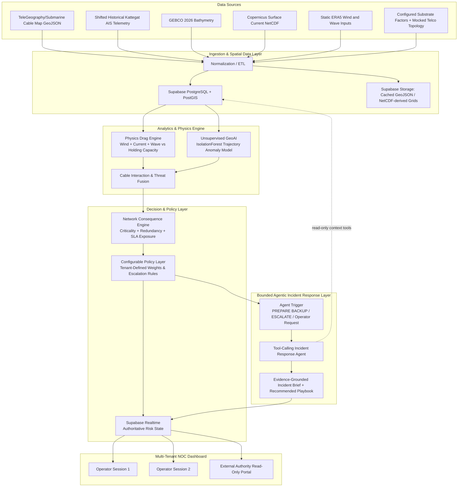

# Product Requirements Document (PRD)

## Product Title: SAMUDERA (Spatial Awareness for Maritime Understanding, Decision Enablement & Response Assistance)

* **Document Version:** 1.1.1 (Corrected MVP + Bounded Agentic AI + Navigable NOC UI Baseline)
* **Target Track:** GeoAI 2026 — Industry Improvement (II) Track
* **Target Industry:** Telecommunications, Submarine Cable Consortiums, Infrastructure Defense
* **MVP Target Region:** Mersing Subsea Cable Corridor (AAG, ASE, East-West, SEAX-1, SKR1M)
* **Deployment Stack:** Next.js 14+ (Vercel) + FastAPI (Python) + Supabase (PostgreSQL / PostGIS / Auth / Realtime / Storage) + bounded tool-calling Agentic AI orchestration

---

## 1. Document Control & Metadata

| Attribute | Details |
| --- | --- |
| **System Name** | S.A.M.U.D.E.R.A. |
| **Document Purpose** | Production-grade System Specification & Product Requirements |
| **Primary End-User** | Telco Network Operations Center (NOC) Engineers & Operations Managers |
| **Secondary End-User** | Submarine Cable Consortiums & Maritime Regulatory Authorities (e.g., APMM / Coast Guard) |
| **Core Architecture** | Multi-Tenant Serverless Cloud Architecture with Row-Level Security (RLS) and a bounded human-in-the-loop Agentic AI incident-response layer |

---

## 2. Executive Summary & Problem Context

### 2.1 Executive Summary

Submarine telecommunications cables carry over **99% of international data traffic** across approximately 500 cable systems spanning more than 1.7 million kilometers. Dragged ship anchors account for roughly **30% of all subsea cable faults** (approximately 60 incidents annually), costing between **£500,000 and £1,000,000+ ($1.5M+ USD)** in specialized repair vessel mobilization per incident, alongside months of lost capacity and severe B2B Service Level Agreement (SLA) financial penalties.

Existing commercial solutions (e.g., AssetMonitor, OptoDAS) focus primarily on physical detection—notifying operators *that* a vessel is near a cable. **S.A.M.U.D.E.R.A.** acts as the critical **Translation and Decision Layer** above detection. By fusing bathymetry and configurable seabed-holding assumptions, hydrodynamic drag vectors, vessel trajectory telemetry, and subsea cable topology, the system quantifies business impact and runs risk scores through a **Configurable Policy Layer**. A bounded **Agentic Incident Response Layer** then uses approved read-only tools to gather the relevant physics, anomaly, cable, network, and tenant-policy evidence, assemble an incident brief, and recommend the next operational steps. The authoritative risk state remains deterministic and human-in-the-loop: the agent cannot override `MONITOR`, `PREPARE BACKUP`, or `ESCALATE`, transmit external warnings, or reroute network traffic. This reduces alarm fatigue while enabling proactive, explainable traffic protection.

### 2.2 Strategic Value Propositions

* **Proactive Traffic Protection:** Shifts NOC operations from reactive post-cut disaster recovery to proactive traffic rerouting preparation before physical strikes occur.
* **Reduction of Alarm Fatigue:** Replaces arbitrary spatial proximity alerts with a dual-engine model combining hydrodynamic drag physics vectors and unsupervised trajectory anomaly detection.
* **Enterprise Multi-Tenant Customization:** Enables individual telecommunications providers to define custom escalation rules, SLA cost matrices, and notification hierarchies through a modular rules manager.
* **Agentic Incident Triage:** A bounded tool-calling incident-response agent autonomously gathers the evidence needed for a flagged event and prepares an explainable response plan, while deterministic risk engines and human approval retain operational authority.

---

## 3. Stakeholders & Value Proposition Matrix

| Stakeholder Group | Primary Role | Operational Pain Point | S.A.M.U.D.E.R.A. Solution & Gain |
| --- | --- | --- | --- |
| **Telco NOC Engineers** | Primary Operator | Alarm fatigue from false alerts; delayed notification forcing reactive post-cut chaos. | Receives mathematically justified, prioritized risk scores with clear escalation paths (`PREPARE BACKUP`). |
| **Cable Consortiums / Owners** | Primary Beneficiary | $1.5M+ USD in emergency repair vessel charter costs and long repair delays. | Helps reduce the likelihood and operational impact of anchor strikes by enabling earlier intervention and traffic-protection preparation. |
| **Enterprise Clients** | End Consumer | Sudden service downtime, latency spikes, and severe productivity losses during unannounced cable snaps. | Reduces the likelihood and severity of service disruption through planned traffic migration before a potential physical cable strike. |
| **Maritime Authorities (APMM)** | External Responder | Inability to monitor vast ocean zones efficiently; delayed communication from telcos. | Receives human-approved, pre-drafted localized dispatch information containing verified high-risk vessel coordinates and threat context. |

---

## 4. User Roles & Access Control (RBAC)

The system enforces multi-tenant security and user isolation via Supabase Authentication (JWT) and PostgreSQL Row-Level Security (RLS) policies. RLS policies shall derive the authenticated user from `auth.uid()` and verify that user's membership and role within the requested tenant before allowing access to tenant-scoped records.

```text
+---------------------------------------------------------------------------------+
|                                 TENANT ISOLATION                                |
|                                                                                 |
|  +----------------------------------+    +----------------------------------+    |
|  |       TENANT A (e.g., TM)       |    |      TENANT B (e.g., Maxis)     |    |
|  |  - Custom SLA Cost Matrices     |    |  - Custom SLA Cost Matrices     |    |
|  |  - Private Cable Criticality    |    |  - Private Cable Criticality    |    |
|  |  - Custom Escalation Workflows  |    |  - Custom Escalation Workflows  |    |
|  +----------------------------------+    +----------------------------------+    |
|                                                                                 |
|      Enforced via Supabase Auth + tenant membership + PostgreSQL RLS            |
+---------------------------------------------------------------------------------+
```

### Role Specification

1. **System Administrator / Platform Engineer:** Manages global system health, corridor boundaries, third-party API configurations, and tenant onboarding.
2. **NOC Policy Administrator:** Defines tenant-specific escalation thresholds, SLA financial exposure variables, and agency notification contacts.
3. **NOC Monitoring Operator:** Monitors real-time spatial dashboards, interacts with simulation stress-testing sliders, reviews the Agentic Incident Response brief/recommended playbook, acknowledges system alerts, and approves dispatch recommendations.
4. **External Maritime Observer:** Accesses a restricted, read-only interface displaying verified `ESCALATE`-level threats and human-approved, pre-formatted dispatch information.

---

## 5. System Architecture & End-to-End Processing Pipeline



---

## 6. Functional Requirements

### 6.1 Module A: Geospatial Data Ingestion & Spatial Indexing

* **REQ-A1 (Cable Infrastructure Mapping):** The system shall fetch subsea cable line geometries and landing point coordinates from the publicly accessible Submarine Cable Map v3 GeoJSON endpoints (`/api/v3/cable/cable-geo.json` and `/api/v3/landing-point/landing-point-geo.json`), filtering specifically for Mersing landing systems (AAG, ASE, East-West, SEAX-1, SKR1M). External data shall be normalized into an internal schema and cached so upstream schema changes do not directly break the application.
* **REQ-A2 (Seabed & Bathymetry Layer):** The system shall ingest GEBCO 2026 bathymetric grids to map water depth ($D_{\text{water}}$). GEBCO bathymetry shall **not** be treated as a seabed sediment/substrate map. For the MVP, normalized seabed holding factors ($K_{\text{soil}}$) shall come from a separate configurable corridor profile or mocked geotechnical lookup; a future validated seabed-sediment/chart source may replace that configuration.
* **REQ-A3 (Metocean Data Processing):** The backend shall convert Copernicus Marine NetCDF ocean-current fields from `GLOBAL_ANALYSISFORECAST_PHY_001_024`, specifically eastward and northward sea-water velocity components, into localized JSON/vector-grid data using Python `xarray`. For the MVP, a downloaded snapshot may be used; automated ingestion is a Phase 2 capability.
* **REQ-A4 (Spatial Indexing Optimization):** Production proximity checks shall use PostGIS spatial indexes (GiST) with functions such as `ST_DWithin` and `ST_Intersects`. GeoPandas/Shapely spatial indexing may be used for local preprocessing or batch ETL. The implementation shall meet the spatial-query latency target defined in Section 10 rather than claiming strict $O(1)$ query complexity.

### 6.2 Module B: Dual-Engine Risk Modeling

* **REQ-B1 (Vector Drag Physics Engine):** The backend shall calculate total environmental drag force vectors ($\vec{F}_{\text{env}}$) acting on vessels using independent vector summation of wind, current, and wave forces, comparing the resultant magnitude against multi-factor holding capacity ($F_{\text{hold,crit}}$).
* **REQ-B2 (Interactive Weather Simulation Sliders):** The UI shall provide real-time override sliders for "Wind Speed (m/s)" and "Wave Height (m)" that dynamically recompute the physics engine on the fly for demonstration and stress-testing. These sliders are **what-if simulation overrides**, not a claim of live weather ingestion.
* **REQ-B3 (Unsupervised GeoAI Anomaly Engine):** The MVP shall run an `IsolationForest` model (`scikit-learn`) on trajectory features—Speed Over Ground (SOG), Course Over Ground (COG), and dwell time—to flag abnormal drifting/loitering behavior without requiring labeled historical failure data. `DBSCAN` may be retained as an experimental alternative, but `IsolationForest` is the MVP baseline to avoid implementation ambiguity.

### 6.3 Module C: Network Consequence & Configurable Policy Layer

* **REQ-C1 (Network Consequence Scoring):** The system shall calculate business consequence per cable segment using:

$$\text{Network Consequence} = R_{\text{drag}} \cdot \text{Criticality Tier} \cdot \left( \frac{1}{\text{Effective Redundancy}} \right)$$

where `Effective Redundancy` is a configurable positive integer with a minimum value of `1`. For the MVP, `1` represents no usable alternate route / highest consequence; larger values represent greater available redundancy.

* **REQ-C2 (Configurable Policy Rules):** The platform shall provide a modular rules engine allowing administrators to adjust weights and set custom escalation responses per corridor. The following are the **default operational policy thresholds**, which are intentionally more conservative than the physical load-limit interpretation in Section 7.3:
  * `MONITOR`: $R_{\text{drag}} < 0.60$ or normal transit behavior.
  * `PREPARE BACKUP`: $0.60 \le R_{\text{drag}} < 0.85$ with vessel slowing inside the cable buffer zone. Triggers internal NOC disaster recovery preparation.
  * `ESCALATE`: $R_{\text{drag}} \ge 0.85$ or a trajectory anomaly is flagged over a high-criticality cable. Generates a dispatch draft and prompts the operator to contact the appropriate authority.

The policy layer may therefore escalate **before** $R_{\text{drag}} = 1.0$ as a precaution. The physical bands in Section 7.3 describe engineering interpretation; the policy rules in this section determine operational action.

### 6.4 Module D: Human-in-the-Loop NOC Command Dashboard

* **REQ-D1 (GPU-Accelerated 3D Map):** The frontend shall render dynamic vessel vectors and subsea cable lines with a target of $\ge 50 \text{ FPS}$ under the defined MVP benchmark using Deck.gl with React Map GL / a Mapbox-compatible basemap.
* **REQ-D2 (Explainable Physics Inspection):** Clicking a flagged vessel shall display an inspectable panel showing the underlying vector forces ($\vec{F}_{\text{wind}}, \vec{F}_{\text{current}}, \vec{F}_{\text{wave}}$), depth, configured substrate factor, anomaly status, and SLA/network consequence score.
* **REQ-D3 (Human-Approved Dispatch Generator):** In the `ESCALATE` state, the dashboard shall generate a pre-formatted dispatch draft including vessel MMSI, GPS coordinates, corridor identifier, threat basis, and a request to maintain safe clearance / coordinate with the relevant maritime authority. The system shall **not autonomously transmit** the message or issue navigational commands; an authorized human operator must review and approve any external communication.

* **REQ-D4 (Navigable NOC Information Architecture):** The frontend shall provide a persistent, navigable NOC application shell with role-aware navigation. The MVP routes shall include:
  * `/dashboard` — primary 3D operational map, KPI summary, active-threat queue, and what-if wind/wave controls.
  * `/incidents` — filterable list of `MONITOR`, `PREPARE BACKUP`, and `ESCALATE` events.
  * `/incidents/[id]` — incident workspace containing the threat timeline, physics breakdown, anomaly evidence, cable/network consequence, authoritative policy state, Agentic Incident Response brief, and human approval controls.
  * `/vessels` — searchable vessel list with trajectory/context inspection.
  * `/cables` — Mersing cable/corridor map and segment criticality/redundancy context.
  * `/policies` — tenant policy/rule management for authorized NOC Policy Administrators.
  * `/observer` — restricted read-only view for verified `ESCALATE`-level incidents intended for External Maritime Observers.
* **REQ-D5 (Persistent Dashboard Shell):** Authenticated NOC routes shall share a consistent application shell with sidebar/top navigation, tenant identity, current user role, alert-state indicators, and clear navigation back to the main operational map. Selecting a vessel, cable, or incident shall open the relevant detail view without duplicating authoritative risk calculations in the browser.
* **REQ-D6 (Incident Brief & Approval UX):** Agent-generated incident briefs and recommended playbooks shall be rendered inside the incident workspace with visible evidence references, uncertainty/missing-data flags, the authoritative policy state, and explicit human approval/rejection controls. The UI shall never present an agent recommendation as an already executed action.
* **REQ-D7 (Frontend Authority Boundary):** The frontend is the presentation and human-control plane. It may request simulations and display results, but authoritative physics, anomaly, consequence, policy, and agent-tool execution remain server-side.

### 6.5 Module E: Bounded Agentic Incident Response

* **REQ-E1 (Agent Trigger & Goal):** When the authoritative Policy Layer produces `PREPARE BACKUP` or `ESCALATE`, or when an authorized NOC operator explicitly requests an investigation, the backend shall create an Agentic Incident Response run whose goal is to assemble the minimum evidence required to explain the event and propose the next operational steps. `MONITOR` events shall not automatically invoke the agent unless requested by an operator.
* **REQ-E2 (Tool-Calling Orchestration):** The agent shall be able to choose and sequence approved **read-only** backend tools such as `get_threat_snapshot`, `get_recent_trajectory`, `get_physics_breakdown`, `get_anomaly_result`, `get_cable_context`, `get_network_consequence`, and `get_tenant_policy`. The agent may make multiple tool calls when required and may request updated context before finalizing its response.
* **REQ-E3 (Grounded Incident Brief):** The agent output shall be structured and evidence-grounded, containing: current authoritative policy state, threat summary, supporting physics/anomaly evidence, affected cable/network context, relevant tenant rule(s), uncertainty or missing-data flags, and a recommended NOC playbook. The response must distinguish retrieved/calculated evidence from model-generated narrative.
* **REQ-E4 (Authority Boundary):** The agent is **advisory and orchestration-only**. It shall not modify `R_drag`, anomaly scores, network consequence values, tenant policy rules, or the authoritative `MONITOR` / `PREPARE BACKUP` / `ESCALATE` state. It shall not directly transmit maritime warnings, execute network rerouting, acknowledge alerts on behalf of an operator, or perform any other external side effect.
* **REQ-E5 (Human-in-the-Loop Approval):** For `ESCALATE`, the agent may prepare a recommended response sequence and a dispatch draft, but an authorized human must review and approve any external communication or operational action. If the agent finds conflicting, stale, or insufficient evidence, it shall flag `NEEDS HUMAN REVIEW` rather than inventing missing facts.
* **REQ-E6 (Tenant Isolation & Auditability):** Agent tool calls shall inherit the authenticated user's tenant scope and permissions. Every agent run shall record the triggering event, tool calls, retrieved evidence identifiers, model/provider metadata, generated recommendation, and resulting human approval/rejection outcome for auditability. Secrets and unrelated tenant data shall never be included in the agent context.

---

## 7. Mathematical & Algorithmic Specifications

### 7.1 Environmental Drag Force Vector Equations

Total environmental force acting on an anchored or drifting vessel is modeled as the vector sum of independent wind, current, and wave load vectors:

$$\vec{F}_{\text{env}} = \vec{F}_{\text{wind}} + \vec{F}_{\text{current}} + \vec{F}_{\text{wave}}$$

#### Wind Shear Force Vector

$$\vec{F}_{\text{wind}} = 0.5 \cdot \rho_{\text{air}} \cdot C_w \cdot A_w \cdot \left\lvert V_{\text{wind}} - V_{\text{ship}} \right\rvert^2 \cdot \hat{u}_{\text{rel,wind}}$$

* $\rho_{\text{air}} = 1.225 \text{ kg/m}^3$ (air density at sea level)
* $C_w$: Wind drag coefficient ($0.70 - 1.00$ for modern hull forms)
* $A_w$: Exposed frontal/side windage area ($\text{m}^2$)
* $V_{\text{wind}} - V_{\text{ship}}$: Wind velocity relative to the vessel ($\text{m/s}$)
* $\hat{u}_{\text{rel,wind}}$: Unit vector in the relative-wind direction

#### Current Velocity Force Vector

$$\vec{F}_{\text{current}} = 0.5 \cdot \rho_{\text{water}} \cdot C_c \cdot A_c \cdot \left\lvert V_{\text{current}} - V_{\text{ship}} \right\rvert^2 \cdot \hat{u}_{\text{rel,current}}$$

* $\rho_{\text{water}} = 1025 \text{ kg/m}^3$ (seawater density)
* $C_c$: Current drag coefficient ($\approx 1.0$)
* $A_c$: Effective submerged hull area exposed to the current ($\text{m}^2$)
* $V_{\text{current}} = \sqrt{U^2 + V^2}$: Current magnitude derived from Copernicus eastward/northward velocity components ($\text{m/s}$)
* $\hat{u}_{\text{rel,current}}$: Unit vector in the relative-current direction

#### Wave Surge Force Vector (Radiation-Stress Proxy)

Grounded in a simplified linear-wave-energy proxy, scaling with wave energy density ($E \approx \frac{1}{8} \rho_{\text{water}} g H_s^2$):

$$\vec{F}_{\text{wave}} = C_{\text{wave}} \cdot K(h,T) \cdot E \cdot B_{\text{eff}} \cdot \hat{u}_{\text{wave}}$$

* $H_s$: Significant wave height ($\text{m}$)
* $g = 9.81 \text{ m/s}^2$: Gravitational acceleration
* $K(h,T)$: Calibratable depth and wave-period correction factor
* $B_{\text{eff}}$: Effective vessel beam width exposed to wave direction ($\text{m}$)
* $\hat{u}_{\text{wave}}$: Unit vector in the representative wave-force direction

> **MVP modeling note:** The wave-force term is an engineering proxy for comparative risk scoring and demonstration. It is not a substitute for certified vessel/anchor engineering analysis.

### 7.2 Anchor Seabed Holding Capacity

Holding capacity is modeled using a calibratable multi-factor equation accounting for soil/substrate assumptions, anchor geometry, chain scope, and depth:

$$F_{\text{hold,crit}} = F_{\text{hold,ref}} \cdot K_{\text{soil}} \cdot K_{\text{anchor}} \cdot K_{\text{scope}} \cdot K_{\text{depth}}$$

* $F_{\text{hold,ref}}$: Reference anchor holding force baseline
* $K_{\text{soil}}$: Configured seabed holding factor from a separate validated substrate source or an explicitly mocked/configured corridor profile for the MVP; **not derived from GEBCO bathymetry**
* $K_{\text{anchor}}, K_{\text{scope}}, K_{\text{depth}}$: Dimensionless correction factors for anchor type, chain scope, and water depth

### 7.3 Anchor-Drag Susceptibility Index ($R_{\text{drag}}$)

$R_{\text{drag}}$ is a physical load ratio (not a percentage probability) representing physical demand versus estimated holding capacity:

$$R_{\text{drag}} = \frac{\left\lvert\vec{F}_{\text{env}}\right\rvert}{F_{\text{hold,crit}}}$$

| Index Range ($R_{\text{drag}}$) | Physical Interpretation |
| --- | --- |
| $R_{\text{drag}} < 0.50$ | Low environmental loading |
| $0.50 \le R_{\text{drag}} < 0.80$ | Elevated environmental demand |
| $0.80 \le R_{\text{drag}} < 1.00$ | Critical approach to estimated holding limit |
| $R_{\text{drag}} \ge 1.00$ | Estimated environmental load equals or exceeds estimated holding capacity |

These are **physical interpretation bands only**. `MONITOR`, `PREPARE BACKUP`, and `ESCALATE` are produced by the Configurable Policy Layer in Section 6.3 and may use earlier, tenant-defined thresholds.

### 7.4 Agentic Decision-Orchestration Semantics

The Agentic Incident Response Layer operates **after** deterministic analytics and policy evaluation. It does not create the risk state; it investigates and explains that state by selecting from an allowlisted set of read-only tools.

```text
Authoritative analytics / policy result
                │
                v
       Agent receives incident goal
                │
                v
     Select one or more read-only tools
       ├── threat / vessel context
       ├── physics breakdown
       ├── anomaly evidence
       ├── cable + network consequence
       └── tenant policy / runbook context
                │
                v
     Check evidence completeness/conflicts
          │                 │
          │ sufficient      │ insufficient/stale
          v                 v
 Evidence-grounded      NEEDS HUMAN REVIEW
 incident brief + plan
          │
          v
      Human operator
```

This bounded orchestration is the project's **agentic AI component**: the model can autonomously decide which approved information-retrieval tools to call, in what sequence, and whether additional context is needed to complete the incident-analysis goal. Deterministic physics, GeoAI anomaly detection, policy evaluation, and human authorization remain the safety boundaries.

---

## 8. Data Dictionary & Hackathon Data Ingestion Strategy

### 8.1 Minimum Data Dictionary

| Category | Variable | Unit / Type | Source | Purpose |
| --- | --- | --- | --- | --- |
| **Vessel Telemetry** | Lat, Lon, SOG, COG, Heading, MMSI, Vessel Class | Float / String | Shifted Kattegat AIS CSV | Tracks simulated/historical vessel motion and position in the MVP. |
| **Cable Infrastructure** | Line Coordinates, Landing Nodes, Cable Names | GeoJSON MultiLineString / Point | Submarine Cable Map / TeleGeography-derived v3 endpoints | Maps spatial location of subsea assets. |
| **Bathymetry** | Water Depth ($D_{\text{water}}$) | Meters / Float | GEBCO 2026 Grid | Determines water depth and depth-dependent physics inputs. |
| **Substrate / Holding Profile** | Substrate Factor ($K_{\text{soil}}$) | Float | Configured or mocked MVP corridor profile; future validated sediment/chart source | Supplies an explicit anchor-holding modifier without inferring sediment type from GEBCO. |
| **Metocean Currents** | Eastward Velocity ($U$), Northward Velocity ($V$) | $\text{m/s}$ (Float) | Copernicus Marine (`GLOBAL_ANALYSISFORECAST_PHY_001_024`) | Supplies ocean current vectors; MVP may use a downloaded snapshot. |
| **Metocean Weather** | Wind Speed / Direction, Significant Wave Height ($H_s$), optional Wave Period | $\text{m/s}$, Degrees, Meters, Seconds | Static ERA5 snapshot + UI Overrides | Provides wind and wave force inputs and demonstration stress testing. |
| **Network Topology** | Segment ID, Criticality Tier (1–3), Effective Redundancy ($\ge 1$), SLA Exposure Inputs | Integer / Float | Mocked Telco Data | Calculates business consequence and policy escalation context. |
| **Agent Run Context** | Incident ID, authoritative policy state, tool-call evidence references, uncertainty flags | UUID / JSON | Backend + Supabase | Grounds each agent investigation in deterministic system evidence. |
| **Agent Audit Record** | Trigger, tool calls, model metadata, recommendation, human outcome | JSON / Timestamp | Backend + Supabase | Provides traceability for bounded agentic AI behavior. |

### 8.2 MVP Data Pipeline Execution Strategy

1. **Subsea Cables:** Fetch GeoJSON from the Submarine Cable Map v3 endpoints (`/api/v3/cable/cable-geo.json` and `/api/v3/landing-point/landing-point-geo.json`), filter for the Mersing systems, normalize the result, and cache the normalized data.
2. **Bathymetry Data:** Extract a bounded raster slice over the Mersing corridor (centered approximately around Lat $2.43^\circ$, Lon $103.84^\circ$) from GEBCO 2026 and derive water-depth values only.
3. **Substrate / Holding Factors:** Load a clearly labeled configurable or mocked corridor substrate/holding profile for $K_{\text{soil}}$. Do not infer mud/sand type from GEBCO.
4. **AIS Telemetry:** Process the Kattegat AIS CSV dataset by applying a coordinate offset script ($\Delta \text{Lat} \approx -54.07^\circ$, $\Delta \text{Lon} \approx +92.34^\circ$) to shift vessel trajectories over the Mersing corridor. This is simulated/historical telemetry for the MVP, not live AIS.
5. **Metocean Currents:** Convert a downloaded Copernicus `GLOBAL_ANALYSISFORECAST_PHY_001_024` NetCDF subset using Python `xarray` into a clean localized grid containing surface current velocity vectors.
6. **Wind & Wave Inputs:** Use a static ERA5 snapshot for baseline wind/wave conditions and provide manual UI override sliders for live what-if recomputation during demonstrations.
7. **Network Topology:** Load mocked telco cable criticality, redundancy, and SLA exposure data for consequence scoring.
8. **Agentic Incident Response:** For `PREPARE BACKUP` / `ESCALATE` events (or an operator-requested investigation), create an incident run that uses allowlisted read-only tools to retrieve authoritative physics, anomaly, cable, consequence, and tenant-policy evidence before producing a structured incident brief and recommended playbook.

---

## 9. Technology Stack & Infrastructure

```text
+-----------------------------------------------------------------------------------+
|                              FRONTEND (Vercel)                                    |
|   Next.js 14+ (React, TypeScript) | React Map GL / Deck.gl                        |
|   Tailwind CSS | Lucide Icons | Supabase Auth + Realtime Client                   |
+-----------------------------------------------------------------------------------+
                                          |
                                          | HTTPS APIs / Realtime channels
                                          v
+-----------------------------------------------------------------------------------+
|                         BACKEND ENGINE (FastAPI)                                  |
|   Python 3.12+ for Vercel deployment                                              |
|   FastAPI | GeoPandas & Shapely (ETL/preprocessing)                               |
|   scikit-learn (IsolationForest) | xarray / NetCDF parser                         |
|   Threat Fusion | Network Consequence | Configurable Policy | Dispatch Drafting   |
|   Agentic Orchestration: server-side tool-calling LLM adapter + allowlisted tools  |
+-----------------------------------------------------------------------------------+
                                          |
                                          | PostGIS queries / JWT validation
                                          v
+-----------------------------------------------------------------------------------+
|                        DATABASE & AUTH (Supabase Cloud)                            |
|   PostgreSQL + PostGIS (GiST indexes) | Supabase Auth (JWT + Multi-Tenant RLS)    |
|   Supabase Realtime | Supabase Storage (cached geospatial/metocean artifacts)      |
+-----------------------------------------------------------------------------------+
```

### 9.1 Deployment Baseline

* **Frontend:** Next.js deployed on Vercel.
* **Backend:** FastAPI deployed using a supported Vercel Python/FastAPI runtime for the MVP, or an equivalent ASGI host if deployment constraints require it. The API contract shall remain host-independent.
* **Agentic AI:** A server-side provider-adapter layer invokes a tool-capable LLM for bounded incident-response orchestration. The selected model/provider is configuration-driven; provider API credentials are server-only and are never exposed to the browser.
* **Database/Auth/Realtime/Storage:** Supabase Cloud.
* **Secrets:** Browser clients may receive only browser-safe Supabase publishable credentials. Supabase secret/service-role credentials must remain server-side and shall be used only for trusted administrative/ingestion operations that intentionally require elevated access.

---

## 10. Non-Functional Requirements (NFRs)

### 10.1 Security & Multi-Tenant Isolation

* **Encryption Standard:** All public application/API traffic must use HTTPS with modern TLS (TLS 1.2 or higher). Supabase-hosted customer data is expected to use provider-managed encryption at rest (AES-256).
* **Row-Level Security (RLS):** RLS policies must restrict tenant-scoped database access using authenticated user identity (`auth.uid()`) plus tenant-membership/role checks, guaranteeing that Tenant A cannot access Tenant B's private network topology or cost matrices.
* **Secret Management:** Supabase secret/service-role credentials must never be exposed through `NEXT_PUBLIC_*`, browser bundles, client-side JavaScript, or source control.
* **Agent Tool Security:** Agent tools must be explicitly allowlisted, tenant-scoped, and read-only for the MVP. The LLM receives only the minimum incident context needed for the current run and shall never receive Supabase service-role credentials or other infrastructure secrets.

### 10.2 Performance & Concurrency

The following are MVP **performance targets measured under documented benchmark conditions**, not unconditional internet-wide guarantees:

* **Rendering Speed:** The frontend mapping engine should render up to 2,000 simultaneous vessel vectors at a target of $\ge 50 \text{ FPS}$ on the designated demo/reference device without material UI stutter.
* **Spatial Query Latency:** Indexed PostGIS proximity checks (`ST_DWithin`) between vessel positions and subsea cable corridors should target $< 50 \text{ ms}$ at the database/query layer for the MVP dataset.
* **Real-time Synchronization:** Multi-user state updates (e.g., an operator acknowledging a threat) should target $< 300 \text{ ms}$ application-observed propagation under the designated demo/test environment via Supabase Realtime.

### 10.3 Reliability & Generalization

* **Config-Driven Generalization:** Expanding coverage to a new corridor (e.g., Melaka or Kuantan) should require primarily configuration changes such as a bounding box, cable identifiers, and corridor-specific policy/substrate parameters, without changing the core risk-processing pipeline.
* **Decoupled Architecture:** External third-party data formats must be converted to internal standardized schemas to insulate the application from upstream API/schema changes.
* **Human-in-the-Loop Safety:** The deterministic policy engine remains authoritative. The Agentic Incident Response Layer may investigate, summarize, and recommend actions but shall not autonomously transmit maritime warnings, issue navigational commands, acknowledge alerts, change policy state, or execute telco traffic rerouting in the MVP.
* **Agent Traceability:** Each agent run must persist its trigger, tool-call trace/evidence references, model/provider metadata, recommendation, and operator outcome so recommendations can be audited and reproduced from source evidence.

---

## 11. Production Release & Scaling Roadmap

```text
Phase 1: Virtual Hackathon MVP (August 2026)
  ├── Mersing Subsea Corridor Prototype
  ├── Shifted Historical AIS CSV + Submarine Cable Map GeoJSON Integration
  ├── GEBCO Bathymetry + Configured/Mocked Substrate Holding Profile
  ├── Copernicus Current Snapshot + Static ERA5 Wind/Wave Baseline
  ├── Vector Physics Drag Engine + Unsupervised IsolationForest Model
  ├── Bounded Tool-Calling Agentic Incident Response Layer
  └── Navigable Interactive Multi-Tenant NOC Dashboard with What-If Weather Sliders

Phase 2: Post-Hackathon System Refinement (Q4 2026)
  ├── Live AIS Streaming API Ingestion (Spire / MarineTraffic or equivalent)
  ├── Automated Scheduled Copernicus/Weather Ingestion Pipeline
  ├── Validated Seabed Sediment / Geotechnical Data Integration
  ├── Agent Evaluation Harness + Tenant Runbook Retrieval / Grounding
  └── Expanded Corridor Coverage (Straits of Melaka & Kuantan Corridor)

Phase 3: Enterprise Platform Integration (2027)
  ├── Distributed Acoustic Sensing (OptoDAS) Ingestion for AIS-Silent Vessels
  ├── On-Premise / Edge Deployment Support for Enterprise Telco Firewalls
  └── Native NMS Integration Plugins for Ciena MCP & Nokia NSP Systems
```

---

## 12. Implementation Authority & Decision Semantics

1. This PRD is the **primary source of truth** for the MVP. `ARCHITECTURE.md` and `README.md` must remain consistent with it.
2. $R_{\text{drag}}$ is an engineering **susceptibility/load ratio**, not a probability of cable failure.
3. Physical interpretation bands and operational escalation thresholds are intentionally separate concepts.
4. Historical/shifted AIS and static ERA5 inputs must be visibly labeled as simulated/historical/static in the UI and documentation; they must not be presented as live feeds.
5. GEBCO supplies bathymetry/elevation, not mud/sand substrate classification.
6. `IsolationForest` is the MVP anomaly-model baseline.
7. All `ESCALATE` outputs remain human-in-the-loop; external communication requires operator approval.
8. The Agentic Incident Response Layer is advisory and tool-orchestration-only: it may select approved read-only context tools and prepare recommendations, but it cannot override deterministic analytics/policy outputs or perform external side effects.
9. The Next.js NOC Dashboard is a required first-class application surface with explicit navigation and incident-detail workflows; it is not merely a final visualization card or static demo screen.
